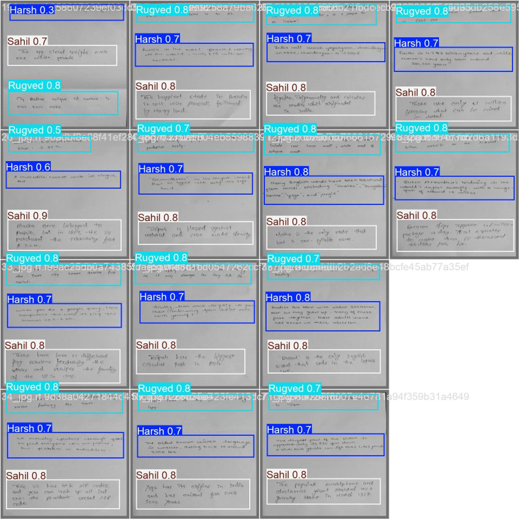
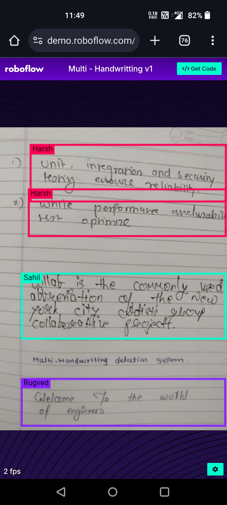

# ✍️ Multi-Handwriting Detection and Classification using YOLOv11

## 📌 Abstract

Understanding and analyzing handwritten text is a critical task in fields like **forensics, document verification, and automated author identification**. While handwriting recognition has progressed significantly, most existing solutions focus on **single-writer detection** or **character-level recognition**, overlooking **multi-writer scenarios** within the same document.

This project introduces a **novel framework** for **multi-handwriting detection and writer classification** within a single page. Leveraging the **YOLOv11 architecture**, the system first **detects handwriting regions** and then performs **classification to attribute each handwriting style to a specific writer**.

Unlike conventional approaches, this **two-stage deep learning pipeline** integrates **detection and classification** seamlessly, ensuring high accuracy and efficiency in distinguishing multiple handwriting styles. Experimental results demonstrate robust performance with **high detection precision** and **accurate writer classification**, even in complex and noisy documents.

✅ Applications include **document verification, fraud detection, forensic handwriting analysis, and automated writer profiling**.
🚀 Future enhancements aim to expand real-time applicability and generalization across diverse datasets.

---

## 🛠 Tech Stack

* **Framework:** PyTorch / Ultralytics YOLOv11
* **Languages:** Python
* **Deep Learning:** CNNs, YOLO-based architectures
* **Tools:** OpenCV, NumPy, Matplotlib, Pandas

---

## 📸 Model Output

Here are some example outputs of the system detecting and classifying multiple handwriting styles:

---

## 📺 Real-Time Output

The system can also perform in **real-time**, classifying different handwriting styles instantly from live input:

---

## 🌟 Acknowledgements

* **YOLOv11** for the robust detection backbone.
* Open-source handwriting datasets and research contributions.
* Community-driven support in AI & document analysis.
